<p align="center">
  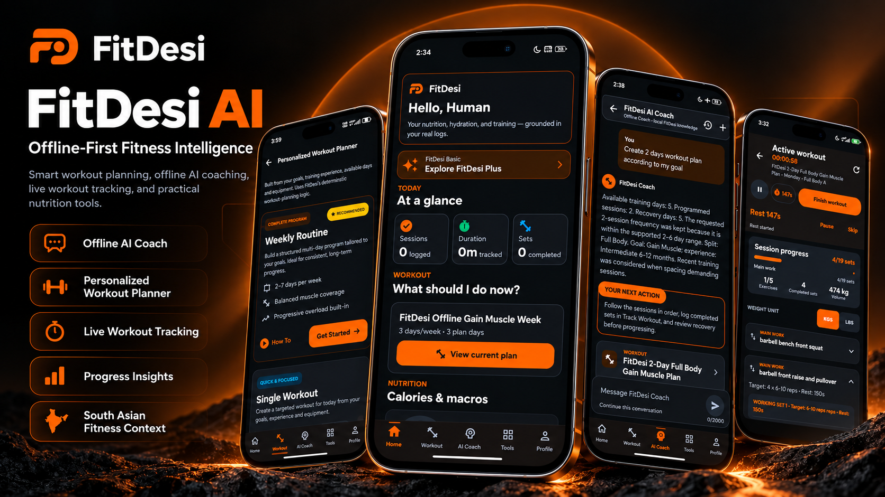
</p>

# FitDesi AI — Offline-First Fitness Intelligence

FitDesi AI is an Android fitness application with a useful local core and South Asian depth. It brings daily fitness context, on-device coaching, structured workouts, practical planning, progress tools, and carefully separated nutrition data into one coherent experience.

**RevenueCat Shipaton 2026 · Next Gen entry** — this repository is the public source snapshot for the FitDesi AI `0.2.0-alpha` current tester preview.

**Demo:** [FitDesi AI — Shipaton 2026 Next Gen Demo](https://youtu.be/bjr0ImZrxWM)

## Useful with or without the cloud

FitDesi is designed to remain useful without a paid model API or an always-on connection. Profile, routine, workout, calorie, and preference data stay within the app's existing persistence layers, while deterministic local engines provide the core Coach and planning behavior.

- **Local-first by design:** essential coaching, tracking, calculators, routines, and saved preferences continue to work without production Remote AI.
- **South Asian depth with honest data states:** culturally familiar foods can be discovered without presenting unverified nutrition as fact.
- **Practical continuity:** workouts, routines, logs, and preferences persist locally across normal use and compatible signed APK updates.

## Product experience

The feature artwork in this section uses generated marketing compositions based on FitDesi product visuals. The stylized phone and device frames are presentation artwork, not Android device captures or evidence of the physical hardware used for testing. These compositions illustrate the capabilities described below; the separate **Real Android Screenshots** section contains the actual unedited tester captures.

### Offline AI Coach

The offline Coach combines local FitDesi knowledge, bounded profile context, and deterministic planning logic to provide workout recommendations, structured fitness and diet guidance, and practical next steps. It can respond across workout, food, progress, and safety topics without presenting itself as a live cloud LLM. Its guidance is general fitness information, not medical advice.

<p align="center">
  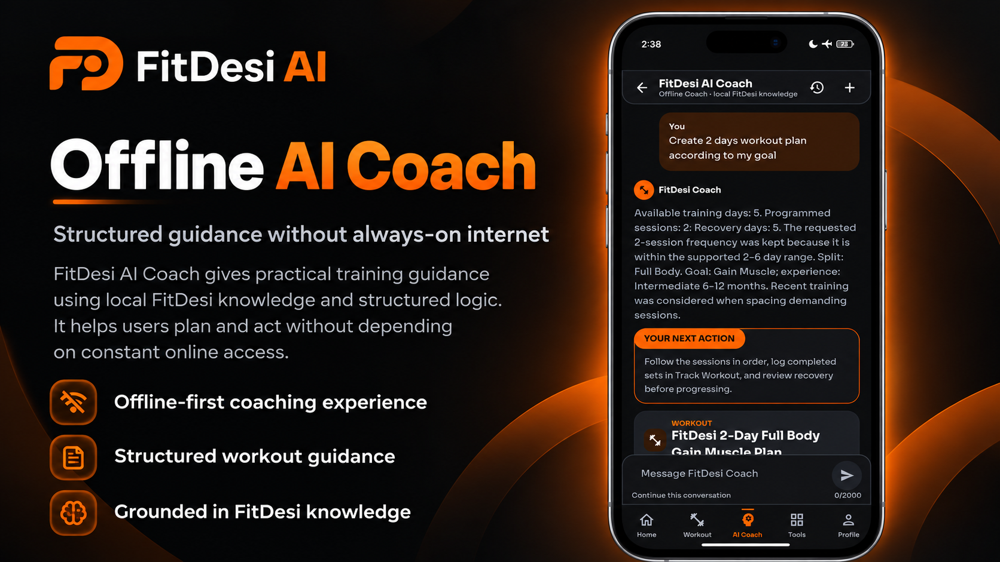
</p>

### Personalized Workout Planner

The Plus planner builds structured workout plans from the user's fitness goal, training experience, available training days, and equipment. It is distinct from the useful offline Coach included in Basic: a plan discussed in a Coach response does not automatically enter My Routines. Users deliberately create and manage routines through the planner and routine tools.

<p align="center">
  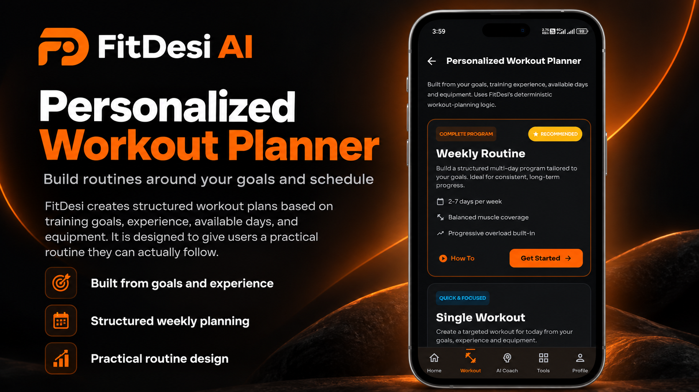
</p>

### Structured Workouts and Live Tracking

FitDesi turns a routine into an active on-device workout experience. Users can work through selected exercises, record working sets with actual weights and repetitions, follow rest timing, and see session progress as they train. Completion summaries and history are based on recorded workout activity; live tracking does not imply cloud synchronization.

<p align="center">
  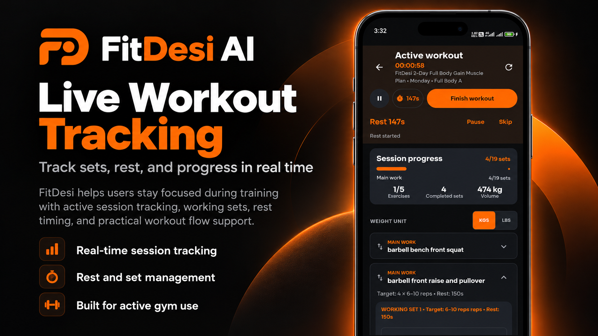
</p>

### Progress Insights

Recorded sessions feed workout history, training trends, and available activity and nutrition analytics. The progress experience helps users review what they completed and understand their recorded patterns without claiming predictive analytics or insights that the current preview does not implement.

<p align="center">
  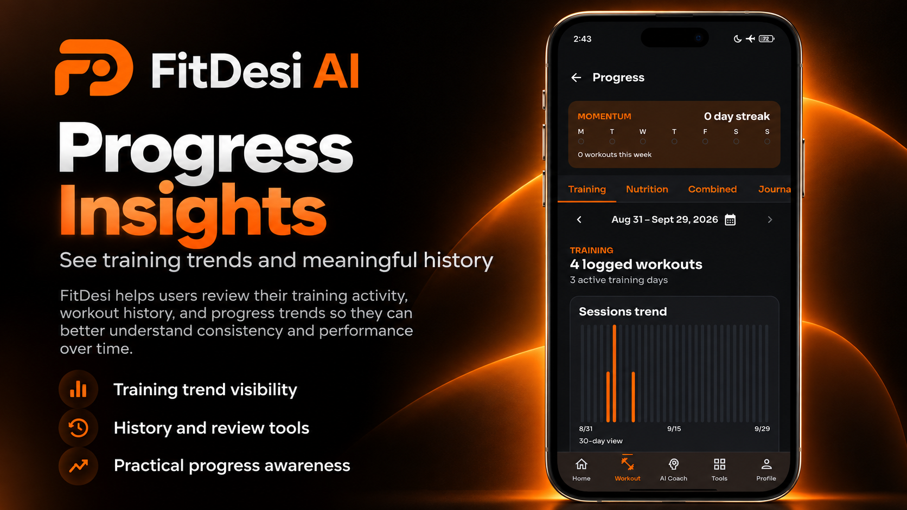
</p>

### Nutrition and Fitness Tools

The Home and Tools experiences bring calorie, macro, hydration, activity, and workout context together with practical utilities such as the Macro Calculator and One-Rep-Max Calculator. Nutrition search includes 39 verified USDA records that can support logging and deterministic calculations, plus 20 South Asian discovery identities that remain nutrition-free and non-loggable until verification is complete.

<p align="center">
  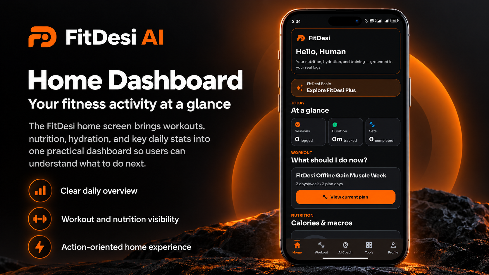
</p>

## Real Android Screenshots

These are the original, unedited Android captures. They show the tester-preview interface, but do not by themselves establish release acceptance or production-service availability.

<p align="center">
  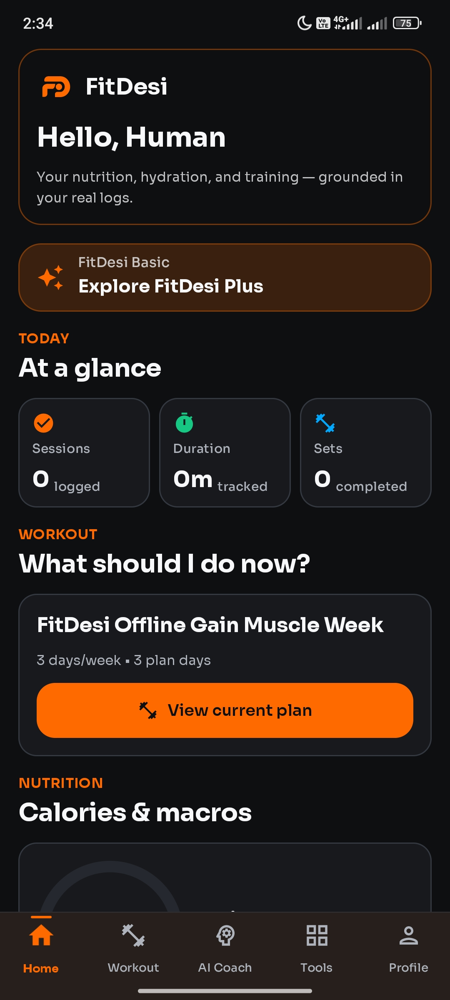
  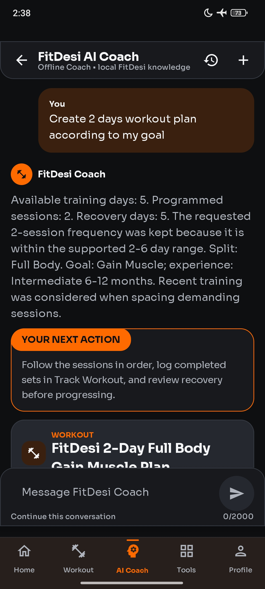
</p>
<p align="center">
  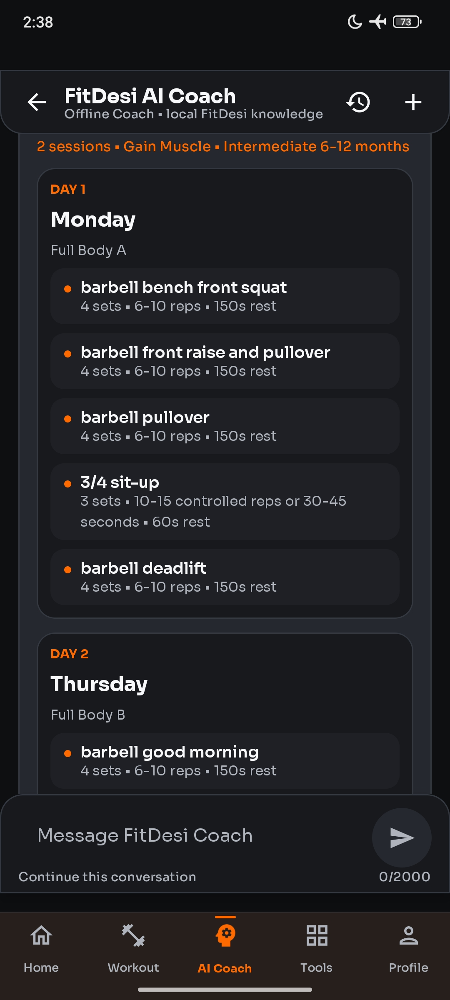
  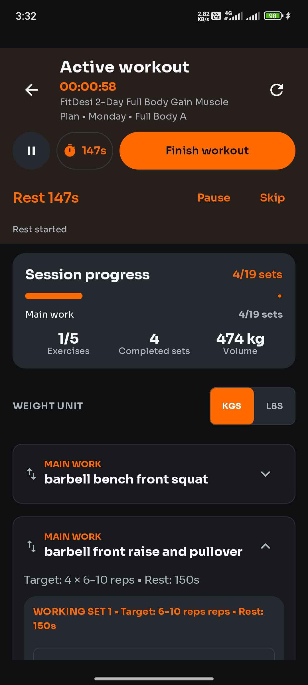
</p>
<p align="center">
  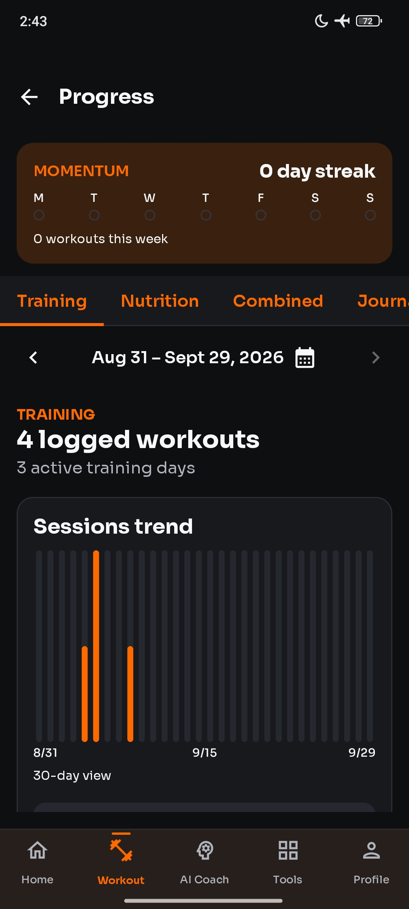
  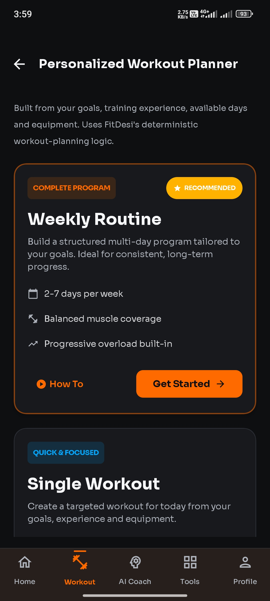
</p>

More original Android captures: [Workout Routines and History](assets/screenshots/05_Workout_Routines_And_History.jpg) · [Basic vs Plus](assets/screenshots/07_Basic_Vs_Plus.jpg) · [Completed Working Set](assets/screenshots/08_Completed_Working_Set.jpg) · [Plus Active](assets/screenshots/09_Plus_Active.jpg)

## FitDesi Basic and Plus

- **Basic — useful by itself.** The local/offline core includes the deterministic Coach, workout tracking, core fitness tools, saved preferences, and access to verified nutrition and discovery data.
- **Plus — deeper planning and progression.** Plus adds the personalized Workout Planner and the additional routine and progress capabilities presented in the current preview.
- **Pro — Coming Soon.** Pro is not launched and cannot currently be purchased.

<p align="center">
  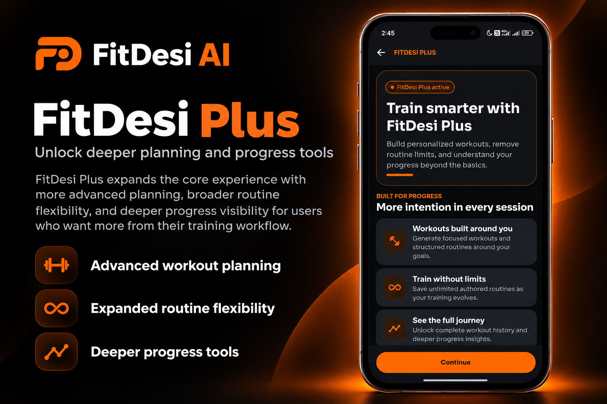
</p>

RevenueCat evidence is limited to manager-supplied Test Store QA: a Monthly purchase activated Plus, Profile and paywall presented Plus, restart while the membership remained active resolved Plus again from CustomerInfo, and the tested active-user Restore path returned Plus active. This is not production Google Play billing, cross-install/store-history restore, publicly distributed APK, or real-revenue evidence. Production Remote AI remains OFF and unlaunched.

## Current development status

This repository is a public source snapshot of FitDesi AI `0.2.0-alpha`. The Android application shown is a **current tester preview**, not a publicly distributed APK or Play Store-ready release. The core local workflow is available; data provenance review, broader device coverage, and production-service decisions remain ongoing.

The Basic / Plus / Pro boundaries above are the current preview positioning. Pro is **Coming Soon** and cannot be purchased. Rewarded Boost exists only in the QA/debug candidate and grants bounded temporary access; release rewarded ads remain disabled. Production Remote AI is OFF and unlaunched. Google Play production publication is deferred.

## Offline-first architecture

Compose screens consume existing ViewModel state and callbacks. Domain logic stays in local engines and repositories, with Room used for workout/calorie records and DataStore used for profile, preferences, and plan/routine state. Bundled exercise and food knowledge supports the offline experience.

The repository also contains a backend under `backend/` (Node 22) with protected provider boundaries for future reviewed deployment. Production Remote AI is OFF and unlaunched. Backend secrets are environment/server-side only and never enter the APK. See [architecture](docs/architecture.md) and [security policy](SECURITY.md).

## Pakistani and South Asian food intelligence

The public-safe runtime uses two strictly separated food layers:

- **Verified nutrition (39 records)** — USDA FoodData Central records that satisfy FitDesi's commercial-verification gate (15 Foundation / 11 FNDDS / 12 SR Legacy / 1 branded-label-derived). These are searchable, loggable, and used in calorie and deterministic diet calculations. Source class: public domain / CC0-1.0.
- **South Asian discovery (20 records)** — FitDesi-authored cultural food identities (roti, biryani, karahi, daal, chole, kabab, lassi, kheer, and more). They are searchable and visible but carry **no** nutrition values, are **not** loggable, and always display “Nutrition verification in progress.” Nutrition verification of additional South Asian foods is ongoing.

Together the food experience surfaces 59 food concepts, but only the 39 verified records contain nutrition — FitDesi does not claim all 59 are nutritionally verified. A separate private engineering catalogue (165 records) retains unresolved legacy and Nourish-derived estimates for historical tooling; those values are excluded from the public runtime and are not redistributed as verified. FitDesi does not claim laboratory precision or perfect household-serving accuracy. See [data sources](docs/DATA_SOURCES.md) and [third-party notices](THIRD_PARTY_NOTICES.md).

## AI Coach architecture accuracy

The Coach uses deterministic offline-first guidance with bounded local persistent conversation history (Coach Chat V2). It classifies bounded requests and returns locally generated fitness, workout, diet, food, progress, and safety guidance. An authenticated remote Coach transport architecture exists behind the backend boundary, but production Remote AI remains intentionally default-off and unlaunched (`AI_PROVIDER=mock`, `REMOTE_AI_ENABLED=false`). No provider key is required for the core demo.

The Coach is not a medical professional. It does not diagnose, treat, or replace qualified clinical advice.

## Installation for testers

The privately signed Shipaton QA APK is maintained separately from this public-source export. An ordinary local `:app:assembleDebug` build uses the developer machine's normal Android debug key, has application ID `com.fitdesiai.app.qa`, and is not byte-for-byte or signing-equivalent to that accepted APK. Updating an existing installation requires a matching application ID and a compatible signing identity. Android may accept the same or a higher `versionCode`, depending on the install/update path and platform policy.

The core preview does not require a paid model API key. Do not share personal health data, credentials, or keystores in issue reports or screenshots.

## Building locally

Requirements:

- JDK 17
- Android SDK compatible with the versions declared in the project
- Android project root: `mobile/`
- Backend (optional, for remote AI development): Node 22, project root: `backend/`
- A Firebase Android client file from your own Firebase project at `mobile/app/google-services.json`. It is ignored by Git and must include a client matching `com.fitdesiai.app.qa` for an ordinary debug build. Do not reuse or publish FitDesi's private QA configuration.

Windows PowerShell:

```powershell
cd mobile
.\gradlew.bat :app:assembleDebug
```

Linux or macOS:

```bash
cd mobile
./gradlew :app:assembleDebug
```

The debug APK is produced under `mobile/app/build/outputs/apk/debug/`. Local preview builds use the normal local debug signature; the core offline demo does not need provider secrets. The Firebase Android client file is build configuration, not a provider or Firebase Admin credential, and must remain outside Git.

Provider credentials and other secrets remain server-side and are supplied by the deployment/secret-management boundary. Firebase Admin uses Application Default Credentials (ADC) / deployment identity; a service-account JSON must never be committed. Service-account JSON, provider keys, and signing material never belong in Git or the APK. See `backend/.env.example` for variable names.

## Technology stack

- **Android:** Kotlin, Jetpack Compose, and Material 3
- **Architecture:** ViewModels, Kotlin Coroutines, Flow, Room, and DataStore
- **Monetization:** RevenueCat Purchases; Shipaton candidate evidence is limited to RevenueCat Test Store QA, and production Google Play billing is not launched
- **Services:** Firebase Authentication and the Firebase Android configuration boundary
- **Networking:** Retrofit, OkHttp, and Moshi
- **Backend:** Node.js 22 protected remote-provider architecture; production Remote AI remains OFF and unlaunched
- **Testing:** JUnit, Robolectric, Roborazzi, and MockWebServer
- **Data:** reviewed exercise knowledge, verified USDA nutrition records, and South Asian discovery data
- **Build tooling:** Gradle and JDK 17; private CI workflow configuration is omitted from the public source snapshot

## Data privacy

Core preview data is stored in the app's existing local persistence layers. Provider credentials and signing material must never be committed to source, resources, screenshots, or logs. Remote services require separate review and are not needed for the current offline preview.

## Safety disclaimer

FitDesi AI provides general fitness and nutrition information only. It does not diagnose, treat, or replace professional medical care, emergency services, or individualized clinical advice. Users should seek qualified help for symptoms, injury, or medical concerns.

## Roadmap

The following are future directions, not capabilities claimed for the current tester preview:

- Explore lightweight on-device intelligence for Basic and offline users
- Research posture and form assistance using efficient device-side machine learning
- Investigate food-image analysis and recipe-to-nutrition workflows only after provenance and serving-basis validation
- Develop a deeper adaptive Remote AI Coach for Pro through the protected server gateway
- Broaden verified South Asian and international nutrition coverage
- Continue accessibility, localization, device coverage, and offline-quality improvements

## Contributing

Please read [CONTRIBUTING.md](CONTRIBUTING.md) before opening an issue or pull request.

## Security reporting

Please read [SECURITY.md](SECURITY.md). Do not disclose vulnerabilities, credentials, or personal fitness data in public issues.

## License

FitDesi AI is released under the [MIT License](LICENSE). See [THIRD_PARTY_NOTICES.md](THIRD_PARTY_NOTICES.md) for exercise-data, food-data, and media restrictions.

## Public-source boundary

This public source repository intentionally omits private engineering history, internal project context, historical audit archives, private food inputs, private CI configuration, credentials, signing material, and build outputs. See the [public export plan](docs/PUBLIC_EXPORT_PLAN.md) and [asset provenance record](docs/ASSET_PROVENANCE.md). Public-only food validation proves the exported snapshot and checksum contract; it does not prove the omitted private derivation.
